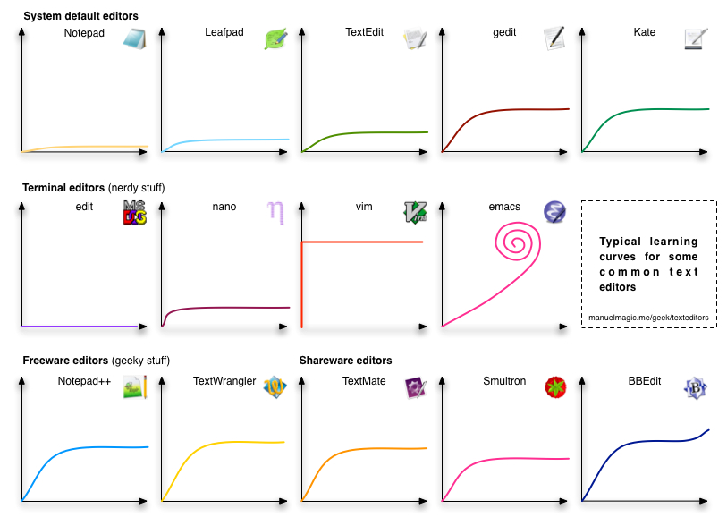

Getting Started
========================================================
author: Mandy Vogel 
date: 23.05.2016
autosize: true
font-import: http://fonts.googleapis.com/css?family=Oswald
font-family: 'Risque'
transition: fade

What is R?
========================================================
type: section

What is R?
========================================================
incremental: true

- R is a high-level language and an environment for data analysis and graphics
- influenced by S (Becker, Chamber, Wilks) and Scheme (Sussman)
  - Trevor Hastie
  - 1980s 
  - AT&T Laboratories

What is R?
========================================================
incremental: true
  
- and created by Ross Ihaka and Robert Gentleman at the university of Auckland
  - released for genereal use 1999
  - for nearly all operating systems
  - now managed by the R Development Core Team (University of Vienna)

What is R?
========================================================

- R is free.
- R is open source.
- R is a dialect of S system.
  
What R can do ...
========================================================
incremental: true

- wide range of statistical methods
- powerful graphics
- data wrangling facilities
  
Why R?
========================================================
incremental: true

-  R is free and R is open source
-  community 
-  most of your problems are already solved and with a high probability the solution is available from one of the repositories (as package)
-  the language is easy to learn and also intuitive
-  the graphics capabilities are impressive


Well, then, why not?
========================================================

Well, then, why not?
========================================================
title: false


Getting help
========================================================
incremental: true

- there is a help browser in the right lower panel
- there are at leat three R related search engines:
  - http://www.rdocumentation.org/
  - http://rseek.org/ (google wrapper)
  - http://finzi.psych.upenn.edu/search.html
- google your question (English!!!): good sites are stackoverflow, stackexchange
- R taskviews: https://cran.r-project.org/web/views/


Getting help inside R
========================================================
incremental: true

- type ?command e.g.

```r
?lm
```
- use **apropos()** e.g.

```r
apropos("linear")
```

Help: Zotero group statistics section
========================================================
Besides all LIFE Publication the group has a statistics section: https://www.zotero.org/groups/unimedleipzig/items

- the group library entries are public
- for full text access you have to be registered (feel free to add documents, hints, comments, links to screencasts, etc...)


GUIs  
========================================================
type: section


GUIs  
========================================================

- to work with the original R console is tedious
- over time many UIs were developed
  - Rattle
  - JGR
  - Notepad++
  - SciViews
  - RGui
  - etc pp...

Recommended GUIs  
========================================================

- Hadley Wickham says:

> [...] **Rstudio**, which I believe is the best development environment for most R users.
> The only real competitor is **Emacs Speaks Statistics (ESS)**.  
  
Why we do not use ESS during the course? 
========================================================


Because one ugly learning curve is enough!
========================================================



Because one ugly learning curve is enough!
========================================================
title: false

PS: I love ESS, at least most of the time...


Let's start!
========================================================
type:section


- the only way to learn R is using R...


Let's start!
========================================================

- Has everybody a working installation? (Start R Studio)


Let's start!
========================================================
- Has everybody the current R version? (type version)


```r
version
```

```
               _                           
platform       x86_64-pc-linux-gnu         
arch           x86_64                      
os             linux-gnu                   
system         x86_64, linux-gnu           
status                                     
major          3                           
minor          3.0                         
year           2016                        
month          05                          
day            03                          
svn rev        70573                       
language       R                           
version.string R version 3.3.0 (2016-05-03)
nickname       Supposedly Educational      
```

Let's start!
========================================================
- Has everybody the current version of RStudio? Type:


```r
RStudio.Version()
```
- you can check for newer versions via the Help menu -> Check for Updates


R as a calculator
========================================================
incremental: true

- in the console you can type commands and R will answer you
- for example you can use R like a calulator

```r
2 + 2
```

```
[1] 4
```

  

```r
sqrt(4)
```

```
[1] 2
```

R scripts
========================================================
incremental: true

- everything you can type in the console you can also type in a script file
- go to the menu: file -> new file and choose R script
- a script file can be saved (everything you typed in the console is much more difficult to recover) so use script files! for your analyses
- in a script file hit Control + Enter simultaneously will send the line to the console
- mark a region and hit Control + Enter will send the marked region

Objects
========================================================
type: section


Create objects
========================================================

- an object can be as simple as a single number
- it can be a table
- or a connection to a data base
- it can be *everything*

Create objects
========================================================
- to work with objects (i.e. assess or use the containing information, manipulate them etc) we give a name to an object (assign), e.g.


```r
x <- 2
y <- 2
```

Create objects
========================================================
incremental: true

- you do not see any result but if you now type

```r
x 
```

```
[1] 2
```


```r
y 
```

```
[1] 2
```


```r
x + y
```

```
[1] 4
```

Assigning
========================================================

- in the beginning the underscore was used for assigning
- then it changed to an arrow (the head of the arrow points to the name, that's what I am using)
- you can also use a equal sign (it is easier to type)
  - it is not the same, 
  - and it makes a difference,
  - but if you do not plan to become a R developer - it is ok...

Assigning
========================================================

- all your created objects are listed (together with some basic information) in the Enviroment tab of the upper right panel (alternatively you use the menu: View -> Show Environment or use Control-8)

Types
========================================================
- we have seen how numbers are assigned to variables
- there are other types, namely **character** and **logical**

Types: character
========================================================

- a variable of type character can be a single letter, a word, a sentence, or a whole book:


```r
a <- "b"
b <- "Wort"
sentence <- "Hello world" 
```

Types: character
========================================================


```r
a 
```

```
[1] "b"
```


```r
b
```

```
[1] "Wort"
```


```r
sentence
```

```
[1] "Hello world"
```


Types: logical
========================================================
incremental: true

- a variable of type logical can have two values: `TRUE` and `FALSE`
- we can turn logical into numerical values, then FALSE will become a 0 and TRUE a 1
- these types of variables are mostly used for filtering, e.g. we can ask

Types: logical
========================================================
incremental: true


```r
x > 3
```

```
[1] FALSE
```


```r
x == 3
```

```
[1] FALSE
```


```r
x < 3
```

```
[1] TRUE
```

Types: logical
========================================================
incremental: true

 - it also works with character


```r
a == "a"
```

```
[1] FALSE
```


```r
a == "b"
```

```
[1] TRUE
```

Types: other
========================================================

- bad news: there are 24 types
- good news: the three above are all 99.9 percent of R users will ever need to know about


Vectors
========================================================
- combining several single values of the same type yields a vector
  - a vector of numbers (i.e. a numeric vector)
  - a vector of characters (i.e. a character vector)
  - a vector consisting of TRUEs and FALSEs (i.e. a logical vector)
- a vector can be seen like a column of a data table

Creation of vectors
========================================================
- one of the most important functions in R is the **c()** 
- c is for *c* oncatenate or *c* ombine


```r
v <- c(1,4,7,2)
v
```

```
[1] 1 4 7 2
```

- so v has more than one element
- we can use *length()* to count the elements contained in a vector

```r
length(v)
```

```
[1] 4
```

Exercise
========================================================
There are some build in vectors in R, containing information frequently used by users. Here are some of them:

- letters
- LETTERS
- month.abb
- month.name

Get the length of these vectors!

Exercise
========================================================

The function 

```r
colors()
```
 produces a vector containing the names of all predefined colors available in R.  

- Use this function in combination with length() to find the number of named colors!  
- What type is the produced vector (remember our three types)?


The Next Step
========================================================

- after vectors we come to **DATA FRAMEs**

Data Frames
========================================================
type: section


Data Frames
========================================================
- in R an object representing a conventional data table is called **data frame**
- a data frame is a rectangular data structure of rows and columns where
  - the columns are containing the variables
  - the rows are containing the observations

Data Frames
========================================================
- as the built-in vectors we seen above R also comes with a lot of example data (https://vincentarelbundock.github.io/Rdatasets/datasets.html)
- go to the console and type


```r
data(iris)
summary(iris)
```

```
  Sepal.Length    Sepal.Width     Petal.Length    Petal.Width   
 Min.   :4.300   Min.   :2.000   Min.   :1.000   Min.   :0.100  
 1st Qu.:5.100   1st Qu.:2.800   1st Qu.:1.600   1st Qu.:0.300  
 Median :5.800   Median :3.000   Median :4.350   Median :1.300  
 Mean   :5.843   Mean   :3.057   Mean   :3.758   Mean   :1.199  
 3rd Qu.:6.400   3rd Qu.:3.300   3rd Qu.:5.100   3rd Qu.:1.800  
 Max.   :7.900   Max.   :4.400   Max.   :6.900   Max.   :2.500  
       Species  
 setosa    :50  
 versicolor:50  
 virginica :50  
                
                
                
```
- the **data()** command loads the data (or promise to do it)
- and **summary()** gives a short summary of the object


Data viewer
========================================================
- for data frame RStudio provides some special functionalities
- one of them is the data viewer:
  - go to the enviromnent tab
  - now you should see two sections *Data* and *Values*
  - in the data section there should be an entry for our **iris** data frame
  - you can click on the blue bullet on the left of the data frame's name
  - you can click on the table symbols on the right -> the data viewer should open

Data viewer
========================================================
The data viewer provides:
  - filtering
  - sorting
  - detaching

Cave: the number of rows as well as the number of columns shown in the data viewer are limited!

Exercise
========================================================
Type the following commands. What do they do?

```r
head(iris)
names(iris)
?iris
nrow(iris)
ncol(iris)
plot(iris)
```

Accessing columns of data frames
========================================================
The first way to access a column of a data frame is typing the name of the data frame followed by a dollar sign followed by the name of the column. **HINT:** RStudio provides very comprehensiv autocompletion functionality by hitting the TAB key 


```r
iris$Petal.Length
```

```
  [1] 1.4 1.4 1.3 1.5 1.4 1.7 1.4 1.5 1.4 1.5 1.5 1.6 1.4 1.1 1.2 1.5 1.3
 [18] 1.4 1.7 1.5 1.7 1.5 1.0 1.7 1.9 1.6 1.6 1.5 1.4 1.6 1.6 1.5 1.5 1.4
 [35] 1.5 1.2 1.3 1.4 1.3 1.5 1.3 1.3 1.3 1.6 1.9 1.4 1.6 1.4 1.5 1.4 4.7
 [52] 4.5 4.9 4.0 4.6 4.5 4.7 3.3 4.6 3.9 3.5 4.2 4.0 4.7 3.6 4.4 4.5 4.1
 [69] 4.5 3.9 4.8 4.0 4.9 4.7 4.3 4.4 4.8 5.0 4.5 3.5 3.8 3.7 3.9 5.1 4.5
 [86] 4.5 4.7 4.4 4.1 4.0 4.4 4.6 4.0 3.3 4.2 4.2 4.2 4.3 3.0 4.1 6.0 5.1
[103] 5.9 5.6 5.8 6.6 4.5 6.3 5.8 6.1 5.1 5.3 5.5 5.0 5.1 5.3 5.5 6.7 6.9
[120] 5.0 5.7 4.9 6.7 4.9 5.7 6.0 4.8 4.9 5.6 5.8 6.1 6.4 5.6 5.1 5.6 6.1
[137] 5.6 5.5 4.8 5.4 5.6 5.1 5.1 5.9 5.7 5.2 5.0 5.2 5.4 5.1
```

Basic plotting using traditional graphics
========================================================
incremental: true

- we have already seen how **plot()** works with data frames
- we also can give plot other objects (like one or two vectors), it tries to guess to figure out the best way to plot the objects given to it


```r
plot(iris$Sepal.Length)
```


Exercise
========================================================

- Run the following lines using autocompletion (TAB!!!!)!
- What kinds of graphics are produced?


```r
plot(iris$Sepal.Length,iris$Petal.Length)
```


```r
plot(iris$Species,iris$Petal.Length)
```


```r
plot(iris$Species)
```


```r
plot(iris$Petal.Length,iris$Species)
```


```r
plot(iris$Sepal.Length,iris$Petal.Length,col=iris$Species)
```

Accessing parts of data frames - part II
========================================================
incremental: true
type: section


Accessing parts of data frames - part II
========================================================
incremental: true

- we've already seen how to access columns using the $-sign
- we also can use numbers (so called indices)
- first we try to extract the 20th element from our *letters* vector from above
  - we need the **20**
  - and square brackets
  - and of course the vector


```r
letters[20]
```

```
[1] "t"
```

Accessing parts of data frames - part II
========================================================
incremental: true
title: false

- we can also get more than one, say we want to write *hello* in a tedious way
  - we need like above the numbers
  - the square brackets
  - the vector
  - but also the **c()** function to combine the single indices 

```r
letters[c(8,5,12,12,15)]
```

```
[1] "h" "e" "l" "l" "o"
```

Accessing parts of data frames - part II
========================================================
incremental: true
title: false


- a vector has one dimensions (only the length)
- so there is only one index needed to access an element of a vector (we use 20 to get the 20th element)

Accessing parts of data frames - part II
========================================================
incremental: true
title: false

- a data frame (a data table) has two dimensions: rows and columns
- to extract a specified element I have to specify both of them, e.g. the element which is in the first row and the first column


```r
iris[1,1]
```

```
[1] 5.1
```

- in R the first index specifies the row(s), the second the column(s)

Accessing parts of data frames - part II
========================================================
title: false

- you can also extract more than one element


```r
iris[c(1,3),1]
```

```
[1] 5.1 4.7
```


```r
iris[1:3,1:3]
```

```
  Sepal.Length Sepal.Width Petal.Length
1          5.1         3.5          1.4
2          4.9         3.0          1.4
3          4.7         3.2          1.3
```

Accessing parts of data frames - part II
========================================================
title: false

- leaving the place for an index blank means *everything*
- first row (type a 1 for the first row before the comma, leave the index for the columns empty)


```r
iris[1,]
```

```
  Sepal.Length Sepal.Width Petal.Length Petal.Width Species
1          5.1         3.5          1.4         0.2  setosa
```

- first column

```r
iris[,1]
```

```
  [1] 5.1 4.9 4.7 4.6 5.0 5.4 4.6 5.0 4.4 4.9 5.4 4.8 4.8 4.3 5.8 5.7 5.4
 [18] 5.1 5.7 5.1 5.4 5.1 4.6 5.1 4.8 5.0 5.0 5.2 5.2 4.7 4.8 5.4 5.2 5.5
 [35] 4.9 5.0 5.5 4.9 4.4 5.1 5.0 4.5 4.4 5.0 5.1 4.8 5.1 4.6 5.3 5.0 7.0
 [52] 6.4 6.9 5.5 6.5 5.7 6.3 4.9 6.6 5.2 5.0 5.9 6.0 6.1 5.6 6.7 5.6 5.8
 [69] 6.2 5.6 5.9 6.1 6.3 6.1 6.4 6.6 6.8 6.7 6.0 5.7 5.5 5.5 5.8 6.0 5.4
 [86] 6.0 6.7 6.3 5.6 5.5 5.5 6.1 5.8 5.0 5.6 5.7 5.7 6.2 5.1 5.7 6.3 5.8
[103] 7.1 6.3 6.5 7.6 4.9 7.3 6.7 7.2 6.5 6.4 6.8 5.7 5.8 6.4 6.5 7.7 7.7
[120] 6.0 6.9 5.6 7.7 6.3 6.7 7.2 6.2 6.1 6.4 7.2 7.4 7.9 6.4 6.3 6.1 7.7
[137] 6.3 6.4 6.0 6.9 6.7 6.9 5.8 6.8 6.7 6.7 6.3 6.5 6.2 5.9
```

Exercise
========================================================
- extract rows 11-15
- extract rows 2,4,and 100
- use the **summary()** function on the *Sepal.Width* column. What is the mean of *Sepal.Width*. (How did you access the respective column, which of the ways did you choose?)
- use the **hist()** function to plot a histogram of *Sepal.Width*

Exercise
========================================================

R can import data of different forms, from different file types, etc.
It is important to remember: for almost every kind of file type you have to 
use a different function, e.g.

File Type | function to load the data | package
----------|--------------------------|---------
.rdata (R's own format) | **load()**| base
.csv (English)      | **read.csv()**| base
.csv  (German)    | **read.csv()** | base
.txt | **read.table()** | base
.xlsx | **read_excel()** | readxl
.sav (SPSS)| **spss.get()**| Hmisc
.dta (Stata) | **stata.get()**|Hmisc
.sasbdat (SAS) | **sas.get()** | Hmisc
.sasxport (SAS Transport Files) | **sasxport.get()** | Hmisc

All these functionalities are also available via the *Import Dataset* dialog. (Menu: Tools -> Import Dataset or via the Environment tab).

Exercise
========================================================

For now we want only use one of these functions to import a data set. Run the following line of code or use the data import menu...


```r
education <- read.csv("http://www.barrolee.com/data/BL_v2.1/BL2013_MF1599_v2.1.csv")
```

Exercise
========================================================

Run **summary()** on the data frame. 
- What is the highest percentage of no schooling (*lu*)
- Plot *lp* (percentage of population with primary school as highest level) vs. *lpc* (percentage which had primary school completed)
- Try indicate different contries by colour
- add a line through (0,0) with a slope of 1 using the command **abline(0,1)**
  - The majority of points are below the line, some are on the line. Why aren't any points above the line? 

