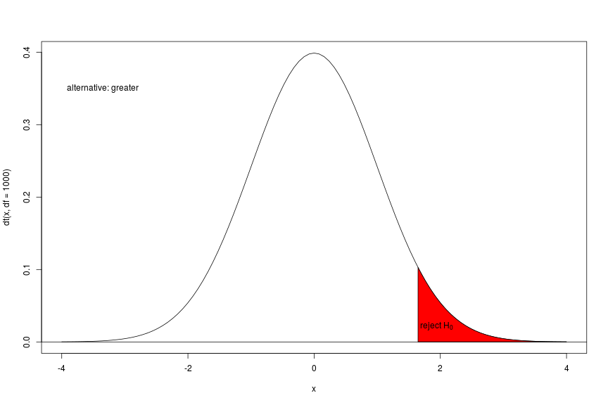

Session 3
========================================================
author: Mandy
date: 06.06.2016
autosize: true

Recap
========================================================
type: section

Recap
========================================================
You should remember
- the concept of the working directory (how to set and get)
- the concepts of packages (install, load)
- loading data into R
  - for every file format the command might be different
  - **read.table()**, **read.csv()**, **read_excel()**, **spss.get()**, etc.

Exercise
========================================================

- set your working directory to today's folder
- load the data set from the file *bird.dat*
  - use **read.table()**
  - be aware: there are no column names (**header=FALSE**)
  - assign the data to an expressive name
  
Recap ggplot2
========================================================

- **ggplot()** needs a data frame as a first argument
- you map qualities of the graphics to variables through **aes()**
- you can add different layers 
  - layers for different kinds of graphics have different names always beginning with **geom_**, e.g.:
    - **geom_point()** for a scatterplot
    - **geom_boxplot()** 
    - **geom_line()**
    - etc pp
    
Exercise
========================================================

1. the variable *EF49* in the mz data set (the spss data set from last week) contains the information about the marital status
  - plot the distribution of this variable using a barplot
  - colour the bars according to sex (*EF46*)
  - use fill to convert into proportions
2. the variables *EF20* (persons in household) and *EF44* (age) contain numeric information 
  - use **ggplot()** to create a scatterplot *EF44* on the x-axis 
     and *EF20* on the y-axis (you need **geom_point()** instead of
     *geom_bar()*)
  - colour the points according to sex
  - interpret! What`s a possible problem

Exercise - Discussion
========================================================
incremental: true

- jitter
- transparency  

Exercise
========================================================
In the data folder inside the session3 folder you find the ALLBUS 2014 data (Allgemeine Bevölkerungsbefragung zu Einstellung, Verhalten und Sozialen Wandel) in two versions: the Stata and the SPSS data file. There is also codebook describing the variables (ZA5240_variablenliste.txt). 

- create a data frame named *allbus* containing the ALLBUS 2014 data set (how many rows/columns?)
- use **ggplot()** to create a boxplot to visualize the distribution of the net income (V417) dependent on sex (V81)
- use **table()** to get the number of male/female participants

Exercise - Discussion
========================================================
incremental: true

- y-scale
- definition of a boxplot
- mixed variable (open/list - top/bottom)
- jitter

Exercise - Questions
========================================================

- Is there a difference in income between male and female? Why do you think so?
- Ignoring the problem of categorized data: we have measurement values from two groups - how can we express a difference between groups in numbers? 

Parameters
========================================================
type: section

Numeric Summaries
========================================================
To describe data we need a proper way to summarize them for easier understanding. Therefore we focus on three main areas:
  - parameters of location (today)
  - spread (today) and
  - shape (someday)

Location Parameter
========================================================
A location parameter is a central or typical value for a distribution
- typical location parameters are:
  - mean (**mean()**)
  - trimmed means (**mean()**)
  - median (**median()**)
  - mode 

Location Parameter
========================================================

- A location parameter is a value which summarizes a specific quality of a distribution. 
- Summarizing means always simplification and therefore a loss of information. 
- Be aware that this is the basic principle of statistics: simplification. And through simplification an understanding of the underlying processes.

The mean
========================================================
How to interpret the mean?
  - graphically, it is the visual balance point of the given values (physics formula for the center of mass)
  - this demonstrates a weakness of the mean when used to represent *center*
  - the *trimmed mean* tries to make the mean more stable by trimming from both sides a certain percentage of the most extreme values
  - if the mean and the trimmed mean are substantially different the data are very likely to be skewed

The mean
========================================================

  - the trimmed mean pushed to its limits (by trimming 50% of the data from each end) leaves us with basically a single value: the median
  - so the median is the value which divides the values into the 50% lowest and the 50% highest values

Exercises
========================================================
Use the ALLBUS data set
- The column V417 contains the net income, calculate the mean using the **mean()** function! What is the problem?
- Again, calculate the mean but now the trimmed version (using the **trim=T** argument). What is the conclusion?

Other measures of location
========================================================
- The concept of the median can be generalized: as the median splits the data in half (with half the data smaller and the other half larger), the $p$ th quantile is basically the value in the data set for which $100\cdot p$  is less than the value and $100 \cdot (1-p)$ is more (so the median is the 0.5 quantile); special cases of quantiles are percentiles, quartiles and quintiles (**quantiles()**)
- hinges (not often mentioned but used in boxplots; **fivenum()**)
- and of course min and max (**min(), max()**)

Is the mean enough?
========================================================

Is the mean enough?
========================================================

Is the mean enough?
========================================================

Parameters of Spread
========================================================
incremental: true
- these are parameters which measure the variability in the data, here are the most used
- there is e.g. the range (**range()**)
- the sample variance (**var()**) and
- the sample standard deviation (**sd()**) which is simply the square root of the variance

Parameters of Spread
========================================================
incremental: true

- the coefficient of variation which is the standard deviation normalized by the mean
- the IQR (interquartile range; *IQR* - there are nine ways to calculate it - so different statistics software can have different IQRs - depending on the method)
- standard errors of a parameter, e.g. standard error of the mean can be understood as the standard deviation of the estimated mean if we would repeat our sampling procedure 

So what next?
========================================================
incremental: true

- now we have different types of location parameter
- and different types of parameters of spread
- so a comparison of our two means above should be a combination of both

So what next?
========================================================
incremental: true
- maybe something like this: 
  - we take the differences between *males* and *females*: $\bar{X}_{male} - \bar{X}_{female}$
  - and devide this difference by the pooled standard deviation (i.e. we calculate the standard deviation of all incomes together): 
  $$\frac{\bar{X}_{male} - \bar{X}_{female}}{s_{overall}}$$
  
So what next?
========================================================
incremental: true

$$\frac{\bar{X}_{male} - \bar{X}_{female}}{s_{overall}}$$
  
- the only thing still missing is to include a measure of how sure we are about our parameters.
- so what would be an appropriate number to measure how sure we are about the parameters?

Combination of parameters
========================================================
incremental: true
So we incorporate the sample size into our little formula

$$\frac{\bar{X}_{male} - \bar{X}_{female}}{s_{overall}\sqrt{\frac{1}{n_1} + \frac{1}{n_2}}}$$

  - now we have a nice measure how reliable our observed difference is including information of:
    - location (the difference itself)
    - the spread of the values (pooled standard deviation)
    - and the sample size as a measure of uncertainty

Combination of parameters
========================================================
incremental: true

- Now we write a nice, simple letter on the left-hand side 
- maybe **t**

$$t = \frac{\bar{X}_{male} - \bar{X}_{female}}{s_{overall}\sqrt{\frac{1}{n_1} + \frac{1}{n_2}}}$$

t-test
========================================================
incremental: false

- Now we write a nice, simple letter on the left-hand side 
- maybe **t**

$$t = \frac{\bar{X}_{male} - \bar{X}_{female}}{s_{overall}\sqrt{\frac{1}{n_1} + \frac{1}{n_2}}}$$

And if a guy named Gosset haven't had invented the t-test yet - we would have done it by now.

t-test
========================================================
incremental: true

- of course: this is a little over simplified
  - there is more than one way to calculate a mystic t-value (and therefore there is more than one t-test)
  - the t-test is called t-test because its test statistic is t distributed under the null (this distribution was discovered or invented or whatsoever by William Gosset and it is a important thing what we have ignored so far)
  
t-test
========================================================
incremental: true

  - so we calculate a t-value (the so called test statistic)
  - now we have a *t* but what does our *t* mean?

From t to p
========================================================
incremental: true

  - we have to compare this value with the distribution of t-values under the null (we will learn about that soon) and transform our t-value to an probability (how likely is the specific *t* or even more extreme *t* values)
  - then we decide: is our t value so unlikely, that we can reject the null? (0.05 - wow! less likely than 5\% - or, is 5\% really that low...??? - this cutoff level was suggested by Fisher in the 1920s, so it is not a part of the decalogue and - therefore - there is no guarantee linked to it)
  

Two sided alternative
========================================================

One sided alternative - less
========================================================

One sided alternative - greater
========================================================

