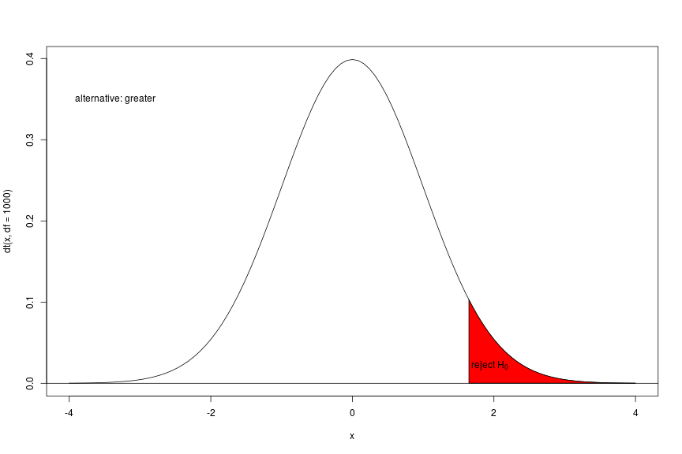
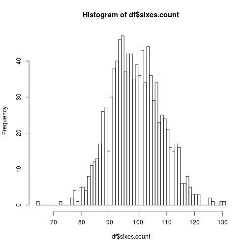
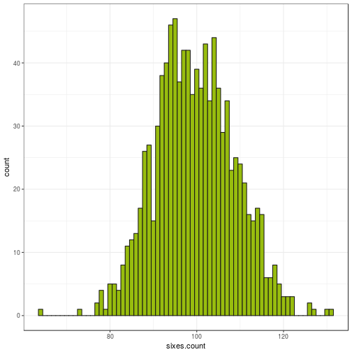

Session 4
========================================================
author: Mandy / Thomas
date: 19 Januar, 2017
autosize: true
css: talk.css
transition: rotate
navigation: section
font-family: times, serif

Recap
========================================================
incremental: true
## You should know:
- **statistics** is all about **simplifying**
- we try to **summarize** and **describe** data through **parameters** of:
    - *LOCATION* 
        - e.g. *mean, median, mode* 
    - *SCALE*
        - e.g. *variance, standard deviation*
    - *SPREAD*
        - e.g. *minimum / maximum / range / quantile / IQR* 
- the meaning of these parameters
- necessary R commands  

Recap
========================================================
incremental: true
## We have seen how
- parameters of   
    - location of two groups (means)
    - spread  (standard deviation)
    - uncertainty (sample size)
incremental: true
- to measure a difference of the location in a standardized manner 
- this measure is compared to a t-distribution relating to a so called **Null-Hypotheses** which one "hopefully" will be rejected to show an effect could exist 

Recap
========================================================
incremental: true
## We have seen how
- this comparision is transformed to a propabiltiy **(p-value)** to get this result by random 
- comparing this propability with a defined maximum propability for a random result (normally 5%) gives the opportunity to decide whether the effect could exist or not
- important is also the effect size itself  
(e.g. is an effect of $\mu_2 - \mu_1 = 101 - 100 = 1$ relevant?)

Test Statistic
============================================
incremental: true
- some property of two groups (Men and Women) are measured.  
- to compare their means, we apply the so called **T-Test**
- to do this we compute the so called **T-Statistic**:  

$$t=\frac{{\bar{X}_{m}}-{\bar{X}_{w}}}{s_{overall}\sqrt{\frac{1}{n_{m}}+\frac{1}{n_{w}}}}$$

Decisions can be right or wrong
========================================================

|           | $H_0$ is true | $H_0$ is false|
|-----------|---------------|---------------|
|$H_0$ is not rejected| Correct decision|Type II error|
|$H_0$ is rejected| Type I error |  Correct decision|


Alternative of alternatives
========================================================
incremental: true
alternative    | options  
-------------- | ----------------
one sided test | less 
               | greater
two sided test | equal   
---------------- | ----------------
one sample test  |  
two sample test  | equal variances
                 | not necessary equal variances  
-------------- | ----------------
unpaired       | 
paired         |  

Alternative of alternatives
========================================================
* two sided - equal


Alternative of alternatives
===
* one sided - less


Alternative of alternatives
===
* one sided - greater



T-Tests in R
========================================================
incremental: true
**There are many options more but only one command in R:**

```t.test( )```


T-Tests in R
===
class: small-code
incremental:true
**One Sample T-Test**

```r
set.seed( 1 )
x <- rnorm( 12 ) ## create random numbers
t.test( x, mu = 0 ) ## population mean 0
```

```

	One Sample t-test

data:  x
t = 1.1478, df = 11, p-value = 0.2754
alternative hypothesis: true mean is not equal to 0
95 percent confidence interval:
 -0.2464740  0.7837494
sample estimates:
mean of x 
0.2686377 
```

T-Tests in R
===
class: small-code
incremental:true
**One Sample T-Test**

```r
t.test( x, mu = 1 ) ## population mean 1
```

```

	One Sample t-test

data:  x
t = -3.125, df = 11, p-value = 0.009664
alternative hypothesis: true mean is not equal to 1
95 percent confidence interval:
 -0.2464740  0.7837494
sample estimates:
mean of x 
0.2686377 
```

T-Tests in R
===
class: small-code
incremental:true
**Two Samples T-Test**
- we have given a two numeric vectors
- we do not assume equal variances for the underlying distributions


```r
set.seed( 1 )
x <- rnorm( 12 )
y <- rnorm( 12 )
head( data.frame( x, y ) )
```

```
           x           y
1 -0.6264538 -0.62124058
2  0.1836433 -2.21469989
3 -0.8356286  1.12493092
4  1.5952808 -0.04493361
5  0.3295078 -0.01619026
6 -0.8204684  0.94383621
```

T-Tests in R
===
class: small-code
incremental:true
**Two Samples T-Test**

```r
t.test( x, y )
```

```

	Welch Two Sample t-test

data:  x and y
t = 0.59393, df = 20.012, p-value = 0.5592
alternative hypothesis: true difference in means is not equal to 0
95 percent confidence interval:
 -0.5966988  1.0717822
sample estimates:
 mean of x  mean of y 
0.26863768 0.03109602 
```

T-Tests in R
===
class: small-code
incremental:true
**Two Samples T-Test**
- we have one numeric vector and one vector containing the group information
- we do not assume equal variances for the underlying distribution

```r
## create random group vector
g <- sample( c( "A", "B" ), 12, replace = T )
head( data.frame( x, g ) )
```

```
           x g
1 -0.6264538 B
2  0.1836433 B
3 -0.8356286 A
4  1.5952808 B
5  0.3295078 A
6 -0.8204684 A
```

T-Tests in R
===
class: small-code
incremental:true
**Two Samples T-Test**

```r
t.test( x ~ g )
```

```

	Welch Two Sample t-test

data:  x by g
t = -0.66442, df = 6.3524, p-value = 0.5298
alternative hypothesis: true difference in means is not equal to 0
95 percent confidence interval:
 -1.6136329  0.9171702
sample estimates:
mean in group A mean in group B 
      0.1235413       0.4717726 
```

T-Tests in R
===
class: small-code
incremental:true
**Two Samples T-Test**
- equal variances now

```r
t.test( x ~ g, var.equal = T )
```

```

	Two Sample t-test

data:  x by g
t = -0.71719, df = 10, p-value = 0.4897
alternative hypothesis: true difference in means is not equal to 0
95 percent confidence interval:
 -1.430111  0.733648
sample estimates:
mean in group A mean in group B 
      0.1235413       0.4717726 
```


When should one use the t-test?
===
incremental:true
- comparision of mean values against a population value or against each other
- the t-test, especially the Welch test is appropriate whenever the underlying distributions are normal
- it is also recommended for a group size equal or larger than 30 (robust against deviation from normality)


Exercise
===
incremental:true
Use the ALLBUS data set:
- do a test of income (V417) for the groups male and female (V81)!
- compare the bmi (V279) of smokers and non-smokers (V272) 
- compare the bmi (V279) of people with high and normal blood pressure (V242)
- how would you interprete the results?
- visualize!


Simulations with R
===
class: small-code
incremental:true
**Rolling the dice**

Suppose you are rolling a fair dice 600 times!  
- How many sixes would you expect?
- How many sixes do we need to reject the $H_0$-Hypotheses using a **two-sided test**?  
- test for **EQUALITY**

```r
qbinom( p = c( .025, .975 ), size = 600, prob = 1 / 6 )
```

```
[1]  82 118
```

Simulations with R
===
class: small-code
incremental:true
What do we have to change for a **one-sided test**?
- test for **LESS**

```r
qbinom( p = .05, size = 600, prob = 1 / 6 )
```

```
[1] 85
```

- test for **GREATER**

```r
qbinom( p = .95, size = 600, prob = 1 / 6 )
```

```
[1] 115
```

Simulations with R
===
class: tiny-code
incremental:true

**Now let's R roll the dice.**


```r
## paranthesis are for executing this row instantly
( dice.trials <- sample( 1 : 6, 600, replace = T ) ) 
```

```
  [1] 6 2 3 2 4 2 3 5 1 6 3 6 3 3 3 6 6 3 5 6 3 5 3 2 5 2 5 1 2 1 2 1 4 6 5
 [36] 5 3 3 5 4 4 3 2 6 4 2 1 3 6 4 6 5 3 3 1 1 5 1 3 4 6 3 3 2 5 3 4 2 2 4
 [71] 4 1 1 4 6 4 4 4 6 4 5 4 2 2 5 3 2 5 1 6 4 4 2 3 4 2 4 1 2 2 2 6 3 5 6
[106] 3 1 3 5 3 4 6 6 3 3 6 4 5 4 6 2 2 6 4 6 2 5 5 6 4 5 3 1 6 2 4 1 6 2 5
[141] 2 2 4 2 2 4 4 1 2 5 6 1 5 6 5 2 4 6 6 3 2 1 2 4 6 4 2 1 3 6 3 1 3 4 3
[176] 5 5 4 3 3 2 4 6 1 3 2 3 1 3 6 5 6 3 4 3 1 2 3 3 6 4 2 2 5 5 1 1 5 4 2
[211] 1 1 3 2 2 2 2 2 3 5 1 4 6 3 1 1 2 1 1 2 2 1 6 2 4 5 1 1 1 6 5 1 3 3 3
[246] 6 2 5 1 3 1 2 6 5 2 3 1 3 6 4 4 2 3 6 6 6 5 5 2 5 6 2 3 5 1 3 3 1 4 6
[281] 6 2 4 3 5 2 3 2 3 5 3 1 5 3 6 2 6 1 6 3 1 2 6 2 4 6 1 5 5 3 3 4 6 2 2
[316] 3 3 6 2 3 3 4 4 6 2 2 5 5 1 6 1 1 6 4 1 3 4 2 3 1 4 2 6 6 6 5 3 5 1 6
[351] 6 3 5 5 5 3 3 2 5 5 3 4 4 1 3 3 1 6 6 6 6 1 3 4 1 5 5 1 3 6 1 2 4 4 2
[386] 3 3 6 1 1 6 3 3 2 1 4 4 6 4 1 1 3 1 3 2 6 5 1 3 5 3 6 5 3 1 2 6 3 3 5
[421] 5 1 6 6 4 4 2 1 6 1 1 6 2 1 3 3 3 4 6 1 4 5 4 4 3 6 3 6 5 4 6 3 1 5 5
[456] 2 4 4 3 4 5 5 3 1 3 6 5 5 6 6 4 1 3 2 1 1 3 3 2 4 3 6 4 2 2 1 6 3 4 5
[491] 6 4 1 6 5 3 1 1 5 5 4 1 3 5 6 5 2 4 2 6 1 3 2 1 5 4 5 3 6 5 3 6 4 1 4
[526] 3 1 4 6 5 4 2 5 4 5 4 3 3 3 3 5 6 1 5 6 6 3 3 6 1 6 3 4 4 5 3 1 3 4 1
[561] 6 2 4 1 2 4 2 4 3 6 6 3 2 5 3 2 1 1 5 5 6 2 6 2 5 2 1 6 5 6 5 6 3 3 4
[596] 1 2 4 5 6
```

Simulations with R
===
class: tiny-code
incremental:true

**Find the sixes!**


```r
dice.trials == 6
```

```
  [1]  TRUE FALSE FALSE FALSE FALSE FALSE FALSE FALSE FALSE  TRUE FALSE
 [12]  TRUE FALSE FALSE FALSE  TRUE  TRUE FALSE FALSE  TRUE FALSE FALSE
 [23] FALSE FALSE FALSE FALSE FALSE FALSE FALSE FALSE FALSE FALSE FALSE
 [34]  TRUE FALSE FALSE FALSE FALSE FALSE FALSE FALSE FALSE FALSE  TRUE
 [45] FALSE FALSE FALSE FALSE  TRUE FALSE  TRUE FALSE FALSE FALSE FALSE
 [56] FALSE FALSE FALSE FALSE FALSE  TRUE FALSE FALSE FALSE FALSE FALSE
 [67] FALSE FALSE FALSE FALSE FALSE FALSE FALSE FALSE  TRUE FALSE FALSE
 [78] FALSE  TRUE FALSE FALSE FALSE FALSE FALSE FALSE FALSE FALSE FALSE
 [89] FALSE  TRUE FALSE FALSE FALSE FALSE FALSE FALSE FALSE FALSE FALSE
[100] FALSE FALSE  TRUE FALSE FALSE  TRUE FALSE FALSE FALSE FALSE FALSE
[111] FALSE  TRUE  TRUE FALSE FALSE  TRUE FALSE FALSE FALSE  TRUE FALSE
[122] FALSE  TRUE FALSE  TRUE FALSE FALSE FALSE  TRUE FALSE FALSE FALSE
[133] FALSE  TRUE FALSE FALSE FALSE  TRUE FALSE FALSE FALSE FALSE FALSE
[144] FALSE FALSE FALSE FALSE FALSE FALSE FALSE  TRUE FALSE FALSE  TRUE
[155] FALSE FALSE FALSE  TRUE  TRUE FALSE FALSE FALSE FALSE FALSE  TRUE
[166] FALSE FALSE FALSE FALSE  TRUE FALSE FALSE FALSE FALSE FALSE FALSE
[177] FALSE FALSE FALSE FALSE FALSE FALSE  TRUE FALSE FALSE FALSE FALSE
[188] FALSE FALSE  TRUE FALSE  TRUE FALSE FALSE FALSE FALSE FALSE FALSE
[199] FALSE  TRUE FALSE FALSE FALSE FALSE FALSE FALSE FALSE FALSE FALSE
[210] FALSE FALSE FALSE FALSE FALSE FALSE FALSE FALSE FALSE FALSE FALSE
[221] FALSE FALSE  TRUE FALSE FALSE FALSE FALSE FALSE FALSE FALSE FALSE
[232] FALSE  TRUE FALSE FALSE FALSE FALSE FALSE FALSE  TRUE FALSE FALSE
[243] FALSE FALSE FALSE  TRUE FALSE FALSE FALSE FALSE FALSE FALSE  TRUE
[254] FALSE FALSE FALSE FALSE FALSE  TRUE FALSE FALSE FALSE FALSE  TRUE
[265]  TRUE  TRUE FALSE FALSE FALSE FALSE  TRUE FALSE FALSE FALSE FALSE
[276] FALSE FALSE FALSE FALSE  TRUE  TRUE FALSE FALSE FALSE FALSE FALSE
[287] FALSE FALSE FALSE FALSE FALSE FALSE FALSE FALSE  TRUE FALSE  TRUE
[298] FALSE  TRUE FALSE FALSE FALSE  TRUE FALSE FALSE  TRUE FALSE FALSE
[309] FALSE FALSE FALSE FALSE  TRUE FALSE FALSE FALSE FALSE  TRUE FALSE
[320] FALSE FALSE FALSE FALSE  TRUE FALSE FALSE FALSE FALSE FALSE  TRUE
[331] FALSE FALSE  TRUE FALSE FALSE FALSE FALSE FALSE FALSE FALSE FALSE
[342] FALSE  TRUE  TRUE  TRUE FALSE FALSE FALSE FALSE  TRUE  TRUE FALSE
[353] FALSE FALSE FALSE FALSE FALSE FALSE FALSE FALSE FALSE FALSE FALSE
[364] FALSE FALSE FALSE FALSE  TRUE  TRUE  TRUE  TRUE FALSE FALSE FALSE
[375] FALSE FALSE FALSE FALSE FALSE  TRUE FALSE FALSE FALSE FALSE FALSE
[386] FALSE FALSE  TRUE FALSE FALSE  TRUE FALSE FALSE FALSE FALSE FALSE
[397] FALSE  TRUE FALSE FALSE FALSE FALSE FALSE FALSE FALSE  TRUE FALSE
[408] FALSE FALSE FALSE FALSE  TRUE FALSE FALSE FALSE FALSE  TRUE FALSE
[419] FALSE FALSE FALSE FALSE  TRUE  TRUE FALSE FALSE FALSE FALSE  TRUE
[430] FALSE FALSE  TRUE FALSE FALSE FALSE FALSE FALSE FALSE  TRUE FALSE
[441] FALSE FALSE FALSE FALSE FALSE  TRUE FALSE  TRUE FALSE FALSE  TRUE
[452] FALSE FALSE FALSE FALSE FALSE FALSE FALSE FALSE FALSE FALSE FALSE
[463] FALSE FALSE FALSE  TRUE FALSE FALSE  TRUE  TRUE FALSE FALSE FALSE
[474] FALSE FALSE FALSE FALSE FALSE FALSE FALSE FALSE  TRUE FALSE FALSE
[485] FALSE FALSE  TRUE FALSE FALSE FALSE  TRUE FALSE FALSE  TRUE FALSE
[496] FALSE FALSE FALSE FALSE FALSE FALSE FALSE FALSE FALSE  TRUE FALSE
[507] FALSE FALSE FALSE  TRUE FALSE FALSE FALSE FALSE FALSE FALSE FALSE
[518] FALSE  TRUE FALSE FALSE  TRUE FALSE FALSE FALSE FALSE FALSE FALSE
[529]  TRUE FALSE FALSE FALSE FALSE FALSE FALSE FALSE FALSE FALSE FALSE
[540] FALSE FALSE  TRUE FALSE FALSE  TRUE  TRUE FALSE FALSE  TRUE FALSE
[551]  TRUE FALSE FALSE FALSE FALSE FALSE FALSE FALSE FALSE FALSE  TRUE
[562] FALSE FALSE FALSE FALSE FALSE FALSE FALSE FALSE  TRUE  TRUE FALSE
[573] FALSE FALSE FALSE FALSE FALSE FALSE FALSE FALSE  TRUE FALSE  TRUE
[584] FALSE FALSE FALSE FALSE  TRUE FALSE  TRUE FALSE  TRUE FALSE FALSE
[595] FALSE FALSE FALSE FALSE FALSE  TRUE
```

Simulations with R
===
class: tiny-code
incremental:true

**Count them!**


```r
## length( dice.trials[ dice.trials == 6 ] ) ## one way
sum( dice.trials == 6 ) ## another way
```

```
[1] 107
```

Simulations with R
===
class: tiny-code
incremental:true

**Now let's R roll the dice very very often!**

Now use the following code to replicate the experiment (rolling one fair dice 600 times) 1000 times!  
The number of sixes are stored in the vector **dice.trials.1000**.

- How many statistically significant results do you expect for a one-sided alternative? 
- How many for a two-sided alternative?
- How many statistically significant results did you get? (You can use **table( )** in combination with a logical function.)
- Visualize the result using **ggplot2** and **geom_histogram( )**! Look at the help of geom_histogram! Alternatively you can use **hist( )**.


Simulations with R
===
class: tiny-code
incremental:true

**Now let's R roll the dice very very often!**


```r
dice.trials.1000 <- replicate( 1000, sum( sample( 1 : 6, 600, replace = T ) == 6 ) )
df <- data.frame( repl.count = 1 : 1000, sixes.count = dice.trials.1000 )
head( df )
```

```
  repl.count sixes.count
1          1          96
2          2         109
3          3          93
4          4          99
5          5         122
6          6         105
```

Simulations with R
===
class: tiny-code
incremental:true

**Now let's R roll the dice very very often!**


```r
table( df$sixes.count )
```

```

 64  73  77  78  79  80  81  82  83  84  85  86  87  88  89  90  91  92 
  1   1   2   4   1   5   5   4   8  11  12  13  17  26  27  15  30  38 
 93  94  95  96  97  98  99 100 101 102 103 104 105 106 107 108 109 110 
 40  46  47  37  42  42  35  39  36  43  34  44  36  29  34  23  25  24 
111 112 113 114 115 116 117 118 119 120 121 122 126 127 130 131 
 21  16  15  17  16   6   6   8   5   3   3   3   2   1   1   1 
```

```r
quantile( df$sixes.count, probs = c( 0, .025, .05, .5, .95, .975, 1 ) )
```

```
   0%  2.5%    5%   50%   95% 97.5%  100% 
   64    83    85    99   115   118   131 
```

Simulations with R
===
class: tiny-code
incremental:true

**Now let's R roll the dice very very often!**


```r
hist( df$sixes.count, breaks = 50 )
```




Simulations with R
===
class: tiny-code
incremental:true

**Now let's R roll the dice very very often!**


```r
library( ggplot2 )
## ??geom_histogram
ggplot( df, aes( sixes.count ) ) + geom_histogram( binwidth = 1, col = '#1A1A18', fill = '#98BD0E' ) + theme_bw( )
```



